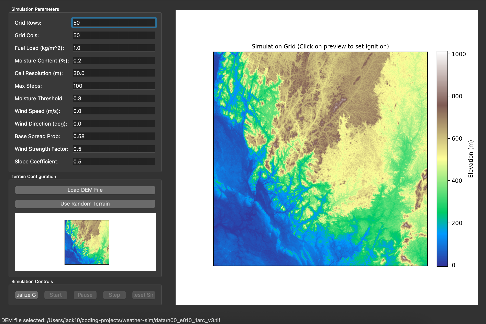

# Wildfire Simulation Project




This project simulates wildfire spread across a 2D grid, incorporating environmental factors such as terrain elevation (slope effects) and wind.

## Features

- **Grid-Based Simulation:** Fire spreads across a 2D grid of cells.
- **Cell States:** Cells can be unburned, burning, or burned out.
- **Elevation Data:**
    - Load terrain elevation from GeoTIFF (.tif) DEM files.
    - Generate random terrain using Perlin noise for testing.
    - Support for flat terrain.
- **Slope Effects:** Fire spread probability is influenced by the terrain slope between adjacent cells (fire spreads faster uphill).
- **Wind Effects:** Fire spread is influenced by wind speed and direction.
- **Configurable Parameters:** Grid size, ignition point, simulation duration, base spread probability, wind parameters, slope coefficient, and cell resolution can be configured.
- **Visualization:** Outputs a PNG image showing the final grid state (burn status) and the elevation map for each simulation run.
- **Command-Line Interface:** A script (`tests/sample_notebook_script.py`) allows for running simulations with various configurations.

For a detailed project plan, including future development ideas and a breakdown of components, please see `planning.md`.

## Setup

**Prerequisites:**
- Python 3.10+ (as per testing environment)
- [Homebrew](https://brew.sh/) (for macOS users, to install `uv`)
- `uv` (Python package manager - recommended)

**1. Clone the Repository (if you haven't already):**
```bash
git clone <your-repository-url>
cd weather-sim
```

**2. Install `uv` (if not already installed):**
```bash
# Using Homebrew on macOS
brew install uv

# Other systems (see uv documentation: https://github.com/astral-sh/uv)
pip install uv
```

**3. Create and Activate a Virtual Environment (using `uv`):**
```bash
# Create a virtual environment named .venv in the project root
uv venv

# Activate the virtual environment
# On macOS/Linux:
source .venv/bin/activate
# On Windows (Git Bash or similar):
# source .venv/Scripts/activate
```

**4. Install Dependencies (using `uv`):**
With the virtual environment activated, install the required packages:
```bash
uv pip install -r requirements.txt
```

## Running the GUI

The main entry point for this project is the interactive wildfire simulation GUI.

### 1. Ensure dependencies are installed
All dependencies, including PyQt6, are listed in `requirements.txt`. If you haven't already, activate your virtual environment and run:
```bash
uv pip install -r requirements.txt
```

### 2. Run the GUI
You can launch the GUI with:
```bash
uv run python -m src.gui
```

Or, if you prefer not to use uv for running the script (but have installed dependencies with it):
```bash
python -m src.gui
```

### 3. Using the GUI
- Load a real-world GeoTIFF DEM file (e.g., Clearlake) via the GUI to initialize terrain.
- Add ignition points by clicking in the bottom left window (terrain map) after the DEM file is loaded.
- Configure simulation parameters (wind, slope, fuel, etc.) in the control panel.
- Run multiple simulations with different settings on the same map to compare outcomes.

For troubleshooting, ensure your virtual environment is activated and all dependencies (especially PyQt6) are installed.

---

## Running Simulations (CLI)

There is also a command-line script for batch simulation runs, located at `tests/sample_notebook_script.py`. This is optional and mainly for advanced users or automated testing.

---